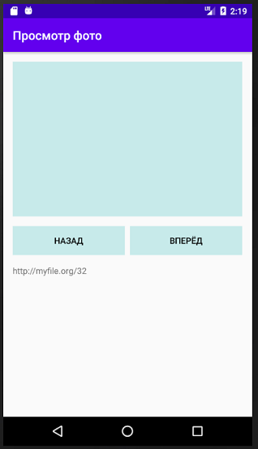

## Задача №2
### Бесконечный переход между экранами
Второе наиболее частое действие в процессе разработки Android программы - переход между экранами. При этом, может быть создано условно бесконечное число экранов (пока хватает памяти у телефона).

Наша задача реализовать каркас приложения для просмотра фотоальбома. В приложении будет 1 экран, в который можно подгружать фотографию для просмотра. Чтобы проходить по фотоальбому нужно, чтобы на этом экране были кнопки "вперед" и "назад". Чтобы не перезаполнять форму, лучше организовать переход на этот же экран только с загрузкой новой фотографии. Внизу экрана, в текстовом поле должна выводится ссылка на изображение: http://myfile.org/<случайное чило от 1 до 100>

Задание:

Создайте экран с текстовым полем, полем для отображения картинки и двумя кнопками:
- “вперед”
- “назад”

При создании экрана текстовое поле должно заполняться ссылкой со случайным числом от 1 до 100. При нажатии кнопки “вперед”- открывается копия данного экрана. При нажатии кнопки “назад”- происходит переход на предыдущий экран, либо (если мы на первом экране) - выход из программы.

Индикатором того, что переход состоялся будет различие случайного числа в текстовом поле.

Загрузку изображения в поле для отоборажения фотографии делать не нужно. Нужно только реализовать переход между экранами и генератор ссылки со случайным числом.

